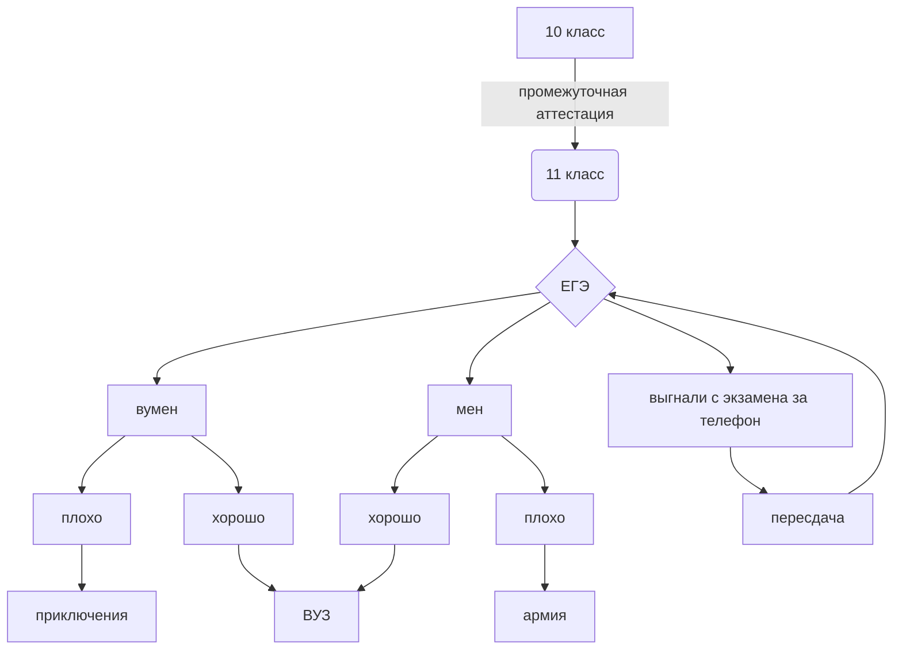

# nazarova
Формулы в LaTeX


$$\frac{\sqrt{\frac{xb}{2}}+cos^{2}|x-b|}{\frac{x^{2}(x+1)}{b}-sin^{2}(x+a)}$$


$$C_{8}H_{18}\to C_{4}H_{10}+C_{4}H_{8}$$


$$\overline{E^{2}}_{1}=\sqrt{\frac{Fa^{^{x-1}}}{(x-1)\cdot x}} +\alpha^{\frac{1}{3}}_{1}+\beta^{\frac{2}{3}}_{2}$$


Формула по логике. Формула дистрибутивности.


$$\left(A \vee  B\right)\wedge C=\left( A\wedge C \right)\vee \left( B\wedge C \right)$$




 


Пояснения к файлам: 

1. Скриншот "Шоу профессий" - Screenshot_20221019_083411.jpg

2. Перевод анг. алфавита в морзе в pyton - morze.py

3. Картинка из Automatic Mouse And Keyboard - Безымянный.png

4. Перевод из недесятичной системы счисления в десятичную - Назарова 132.xlsx

5. Таблица умножения 8-ричной системы/ ряд Фибоначчи - Назарова.xlsx

6. Логическое выражение в pyton - буль.py

7. Код Хемминга в pyton - код Хемминга.py

8. Команды pyton в Jupyter Notebook - назарова132.ipynb

9. Exel таблица в pyton - таблица, но в питоне.py

10. Таблицы Exel с логическими операциями - таблица132.ods / таблица132.xlsx

11. Программа в pyton по решению 3-х видов задач (для к/р) - программка.py

12. Слайдшоу и видео - котята.py

13. Викторина - викторина.py

14. Программка с примером функции - функция.py

15. Теория игр ЕГЭ - mermaid-diagram-2022-12-20-100528.png

16. Задание 13 из ЕГЭ (с графами) - 13 задание ЕГЭ с графами.png

17. Комбайн (программа по выполнению 5-ти задач на выбор) - комбайн.py

18. Полезные конструкции pyton - конструкции пайтона.py


```python 
from itertools import product
tab=[[0,712,673,1075, 875, 1622, 423],
     [712,0, 1385, 1800, 1577, 2348, 1128],
     [673, 1385, 0, 1499, 239, 2046, 244],
     [1075, 1800, 1499, 0, 1287, 551, 1266],
     [875, 1577, 239, 1287, 0, 1835, 442],
     [1622, 2348, 2046 ,551, 1835, 0 ,1813],
     [423, 1128, 244, 1266, 442, 1813 ,0] ]
alf='0123456'
a=product(alf, repeat=7)
maxi=0
p=0
for i in a:
    if all(i.count(x)==1 for x in alf):
        s=0
        for l in range(len(i)-1):
            s+=tab[int(i[l])][int(i[l+1])]
        if s>=maxi:
            maxi=s
            p=i
                       
        
print(maxi,' '.join(p))
```


```python
from itertools import product
a=[x for x in range(3)]
print(a)
#1
for i in a:
    print(i)

for i in range(len(a)):
    print(a[i])
#2.1
for x in range (len(a)):
    for y in range(len(a)):
        print(a[x], a[y])
        
#2.2
for x in range (len(a)):
    for y in range (x+1, len(a)):
        print(a[x], a[y])


#2.3
b=list(product('012', repeat=2))
print(b)


#3
for i in range(len(a)-1):
    if a[i]+a[i+1]>2:
        print(a[i]+a[i+1])

#4
while True:
    status=0
    for i in range(len(a)-1):
        if a[i]<a[i+1]:
            a[i], a[i+1]=a[i+1], a[i]
    print(a)
for i in range(len(a)-1):
 if a[i]<a[i+1]:
    status=status+1
 if status==0:
     break
```
